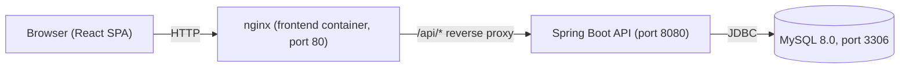

# 01 — Review of the Completed System

## Purpose

OBQA (Outcome Based Quality Assurance) manages Learning Outcomes (LOs), Program Outcomes (POs), student marks, PO/LO mapping, and CQI (Continuous Quality Improvement) action tracking for a university department, aiming toward ABET/NBA/Washington Accord/MQF accreditation readiness.

## Architecture overview

- **Frontend**: React 18 + Vite 5 + TailwindCSS, served by nginx in production/Docker; Vite dev server (port 5173) for local development.
- **Backend**: Spring Boot 3.2.2, Java 17, layered `Model / Repository / Service / RestController / Security`.
- **Database**: MySQL 8.0 (H2 available for `dev` profile).
- **Deployment**: `docker-compose.yml` at repo root defines 3 services — `mysql`, `backend`, `frontend`. CI/CD via GitHub Actions (`.github/workflows/ci-cd.yml`, `ci.yml`) builds/tests and pushes images to `ghcr.io`; CodeQL and SonarQube (`sonar-project.properties`) are already configured.

## Trust boundaries

1. **Browser ↔ nginx/frontend** — fully untrusted client; all input here must be treated as attacker-controlled.
2. **nginx ↔ backend** — reverse-proxied `/api/` traffic; currently the SPA calls `http://localhost:8080` directly rather than through the proxy (see Finding below), so this boundary is partially bypassed in the current build.
3. **Backend ↔ MySQL** — trusted compute to data store; backend holds DB credentials.
4. **JWT crossing boundary 1** — the bearer token is the sole proof of identity/role carried from browser to backend on every request.

## Roles / actors

- `superadmin`, `admin`, `lecture` — the only three values `User.usertype` normalizes to (`Model/User.java`). No `Student` login/role exists anywhere in the backend or frontend, despite a `Student` **entity** existing in the data model (students are managed as records, not as authenticated users).
- Frontend routes gate on these three role strings via `ProtectedRoute.jsx` (client-side only — see Finding below).

## API surface (15 REST controllers)

| Controller | Base path | Notes |
|---|---|---|
| `UserRestController` | `/api/auth` | Login; only path `permitAll()`'d in `SecurityConfig` |
| `ModuleRestController` | `/api/modules` | |
| `OBEController` | `/api/obe` | Marks export/template/bulk-upload |
| `AssessmentController` | `/api/obe/assessment` | |
| `CqiActionController` | `/api/cqi` | |
| `IntegratedLORestController` | `/api/los-with-mapping` | |
| `LOPOMappingRestController` | `/api/lo-po-mapping` | |
| `ProgramOutcomeRestController` | `/api/program-outcomes` | |
| `LosRestController` | `/api/lospos` | |
| `AdminMappingRestController` | — | Empty stub, no `@RequestMapping` |
| `AnalysisRestController` | — | Empty stub |
| `AttainmentRestController` | — | Empty stub |
| `MappingRestController` | — | Empty stub |
| `LosPosRestController` | — | Empty stub |
| `ReportsRestController` | — | Empty stub |

The 6 stub controllers are dead code today (no live attack surface) but are tracked in scope for Phase 6 cleanup (either delete or implement).

## Key data flows

1. **Login**: `POST /api/auth/login` → `CustomUserDetailsService` loads user → password compared via `NoOpPasswordEncoder` (plaintext) → `JwtUtil` issues HS256 JWT (2h expiry) → returned to client, stored in `localStorage`.
2. **Bulk marks upload/export**: Lecturer → `/marks-workbench/:moduleId` → downloads Excel template (`POST /api/obe/template/marks`) → fills it → uploads (`POST /api/obe/marks/upload-bulk`, parsed via Apache POI) → exports pass/fail report (`POST /api/obe/export/marks`).
3. **PO/LO mapping approval**: Lecturer creates mapping → Admin approves via `/lo-po-mappings`.
4. **CQI workflow**: gap review → action plan → tracked via `/api/cqi`.

## Confirmed discrepancies / dead surfaces to keep in mind for scope

- `softwareproject_frontend/src/src/` is an unreferenced duplicate tree (confirmed: `main.jsx` imports only the top-level `App.jsx`) — out of scope for testing, candidate for deletion in Phase 6.
- No "Student" authenticated role exists — testing/threat modeling should treat students purely as data subjects, not as an actor with credentials.
- Frontend calls `http://localhost:8080` directly rather than routing through the nginx `/api/` proxy defined in `nginx.conf` — noted for the Phase 1 test-environment setup and flagged again in Phase 2 architecture review.
