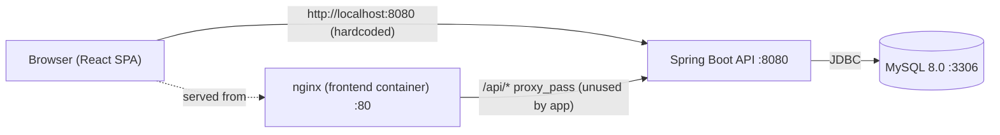
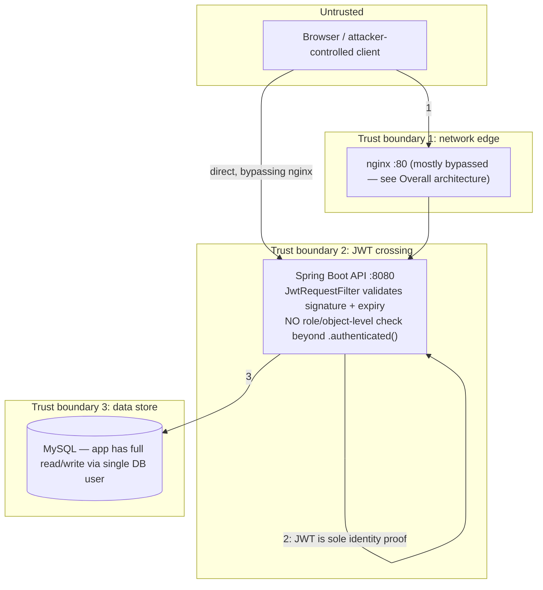

# 06 — Security Architecture Review (Phase 2)

## Overall system architecture

The frontend is built and served by nginx in the Docker Compose deployment, and `nginx.conf` does define an `/api/` reverse proxy to `http://backend:8080/`. However, the React code itself never calls a relative `/api/...` path — every service/page hardcodes `http://localhost:8080` directly (confirmed across `marksService.js`, `cqiService.js`, and most page components). **The nginx proxy is dead configuration**: in the containerized deployment, the browser talks to the backend container directly on port 8080 (exposed via `docker-compose.yml`), bypassing nginx entirely for API calls. This only works because both ports happen to be published to the host; it would break under any deployment where the backend isn't also directly internet-facing. This is an architectural inconsistency to resolve before any real deployment — either wire the frontend to use relative `/api/` paths (matching the nginx config that's already there), or remove the unused proxy block.

## Frontend architecture

- Routing: `react-router-dom` v6, all routes declared in `App.jsx`. Public: `/`, `/loginpage`, `/forgottenpassword`. Everything else wrapped in `<ProtectedRoute>`.
- `ProtectedRoute.jsx`: checks `authService.isLoggedIn()` and, if `requiredRole` is passed, compares it (case-insensitively) against `userType` read from `localStorage`. **This is a pure client-side gate** — it decides what to *render*, not what the server will *allow*. Several routes (`/modules`, `/marks-workbench/:moduleId`, `/lo-po-mappings`, etc.) pass no `requiredRole` at all, so any authenticated user of any role can navigate to them; the real access control has to come from the backend, which (per `04-security-requirements.md`, REQ-AC-01) currently doesn't enforce any.
- `axiosSetup.js`: a global request interceptor attaches `Authorization: Bearer <token>` to every axios call; a response interceptor logs out and redirects on 401. This is well-structured, but several pages bypass it by reading `localStorage.getItem('token')` and building headers manually per-call — a maintenance/consistency risk (a call that forgets the header silently becomes unauthenticated rather than failing loudly).
- Token storage: JWT + role + username in `localStorage` (keys: `token`, `username`, `userType`, `isLoggedIn`, `tokenExpiry`, `rememberMe`). Client-side `tokenExpiry` is just a locally-computed timestamp, not cryptographic — it's a UX nicety, not a control.

## Backend architecture

Layered structure under `com.example.Software.project.Backend`:
- `Model/` — JPA entities.
- `Repository/` — Spring Data JPA interfaces.
- `Service/` — business logic, Excel import/export, user management.
- `RestController/` — 15 classes; 9 have live `@RequestMapping`s, 6 are empty stubs with no mapping at all (`AdminMappingRestController`, `AnalysisRestController`, `AttainmentRestController`, `MappingRestController`, `LosPosRestController`, `ReportsRestController`) — dead code, candidates for deletion or implementation in Phase 6.
- `Security/` — `SecurityConfig`, `JwtUtil`, `JwtRequestFilter`.

The layering itself is conventional and reasonable. The architectural gap isn't the layering — it's that **authorization logic exists on the `User` model (`isAdmin()`, `isLecturer()`, `isSuperAdmin()`) but nothing in the architecture ever calls it**. Individual controllers (`UserRestController`) reimplement their own ad-hoc role checks by manually decoding the JWT's `role` claim from the raw `Authorization` header string (see `isSuperAdmin(String token)` / `isAdmin(String token)` private helpers) — duplicated per-controller rather than centralized. This is fragile: it only exists in `UserRestController`, not in any of the other 8 live controllers, which have zero role checks at all.

## Database architecture

- Schema: `User`, `Student`, `Module`, `Los`, `StudentMark`, `CqiAction`, `ProgramOutcome`, `LosPos`/mapping tables, plus `assessment_item`/`assessment_template`/`student_assessment_score` (seen in the live schema, not previously enumerated in Phase 1 — worth reconciling with `02-asset-inventory.md`).
- `User` table: PK `User_ID` (string, essentially a username), `email` (unique), `password` (plaintext today), `user_type`. No `created_at`/`updated_at`/audit columns anywhere.
- Managed entirely via Hibernate `ddl-auto=update` — no Flyway/Liquibase migration history. Fine for a single-developer academic project's current stage, but means there's no reviewable/rollback-able schema change log, and `update` mode can silently leave stale columns behind after a model change.
- DB access uses a single application-level MySQL user (`appuser` in the Docker setup; `root` in the checked-in local dev config) — no separation between, e.g., a read-only reporting role and the read-write application role.

## API architecture

9 live controllers under `/api/**` (`/api/auth`, `/api/modules`, `/api/obe`, `/api/obe/assessment`, `/api/cqi`, `/api/los-with-mapping`, `/api/lo-po-mapping`, `/api/program-outcomes`, `/api/lospos`). No API versioning (`/api/v1/...`) — any breaking change to a live endpoint has no migration path for existing frontend builds. No consistent error-response shape enforced across controllers (some return `Map.of("message", ..., "status", ...)`, ad hoc per method).

## Authentication architecture

End-to-end flow: `POST /api/auth/login` → `AuthenticationManager` → `DaoAuthenticationProvider` (uses `CustomUserDetailsService` + the configured `PasswordEncoder`, currently `NoOpPasswordEncoder`) → on success, `JwtUtil.generateToken(username, role)` issues an HS256 JWT with a `role` claim and 2-hour expiry → returned to client, stored in `localStorage`.

On subsequent requests, `JwtRequestFilter` (a `OncePerRequestFilter`) reads the `Authorization` header, extracts the username via `JwtUtil.extractUsername`, loads the user via `CustomUserDetailsService`, and — if `validateToken` passes (username match + not expired; signature already implicitly validated by `Jwts.parserBuilder().setSigningKey(...)` throwing on tamper) — populates `SecurityContextHolder` with a `UsernamePasswordAuthenticationToken` carrying the user's single authority (their raw `usertype` string, unprefixed).

Two architectural notes:
- `JwtRequestFilter` only special-cases `/api/auth/login` for "skip JWT parsing" (`requestPath.equals("/api/auth/login")`); it still attempts JWT parsing on every other request including the other permitAll auth endpoints, which is harmless but slightly inconsistent with intent.
- No refresh token, no revocation/blacklist — a leaked or stolen JWT is valid for the full 2 hours no matter what (e.g., logging out client-side does not invalidate the token server-side).

## Authorization architecture

**Correction (Phase 5):** the original version of this section, based on an initial broad code search, claimed the 8 non-`UserRestController` controllers had "no authorization checks of any kind." That was inaccurate — the search correctly found zero `@PreAuthorize`/Spring method-security usage, but missed that most controllers implement equivalent checks manually: each has its own private `isAdmin(token)` / `isLecturer(token)` / `isLecture(token)` helper (independently re-implemented per controller — real duplication, see below) that decodes the JWT's `role` claim directly and gates the method body. Verified directly against the code: `LOPOMappingRestController`, `AssessmentController`, `IntegratedLORestController`, and most of `ProgramOutcomeRestController`, `ModuleRestController`, and `OBEController`'s write endpoints already enforce role checks this way — including the `/admin/...`-named endpoints, which genuinely do require admin/superadmin, contrary to the original claim.

The real gaps, closed in Phase 5:
- `GET /api/auth/debug/user/{username}` and `POST /api/auth/create-test-user` were reachable with **no authentication at all** (covered by a blanket `/api/auth/**` permitAll rule) — the former now requires `admin`/`superadmin` via `@PreAuthorize`, the latter is gated to the `dev` Spring profile.
- Several `ProgramOutcomeRestController` GET endpoints (the PO catalog) had no check, while the frontend's own `/program-outcomes` route is admin-only — tightened to `admin`/`superadmin` for consistency; `DELETE /{poId}/permanent` (irreversible) tightened further to `superadmin` only.
- A residual, lower-severity gap remains: many GET endpoints across `OBEController`, `LosRestController`, etc. accept any of the 3 authenticated roles with no further restriction. Since the system has only three roles (`lecture`, `admin`, `superadmin`) and no lower-privileged "student" role, this is functionally equivalent to today's blanket `.anyRequest().authenticated()` rule and isn't a role-boundary bypass. The genuine remaining risk here is **object-level** authorization (e.g., Lecturer A reading/editing Lecturer B's module data) — deferred to a later pass per the Phase 4 design decision, not fixed in this round.

Architectural cleanup still worth doing (not done in this pass, low risk/cosmetic): the `isAdmin(token)`/`isLecture(token)` JWT-decoding helper is duplicated near-identically across `UserRestController`, `OBEController`, `LOPOMappingRestController`, `IntegratedLORestController`, `ProgramOutcomeRestController`, and `LosRestController` instead of being centralized — a maintenance risk if the JWT claim structure ever changes. `@EnableMethodSecurity` + `@PreAuthorize` (now enabled and used for the fixes above) is the natural replacement path if this is revisited later. Also, `SimpleGrantedAuthority` authorities are not `ROLE_`-prefixed — irrelevant for `hasAuthority(...)` (used here) but would silently break if anyone later switches to `hasRole(...)`.

## Deployment architecture

- `docker-compose.yml`: 3 services (`mysql`, `backend`, `frontend`), custom bridge network, named volume for MySQL data. All three now healthy per Phase 1 verification.
- CI/CD: `.github/workflows/ci-cd.yml` ("CI/CD - Enterprise Grade") runs on push/PR to `main`/`develop`: CodeQL analysis, backend build+test (against an ephemeral MySQL service container), frontend build+test. **CodeQL is configured for `javascript` only — the Java backend is not covered by CodeQL at all**, a gap worth flagging for Phase 6. `.github/workflows/ci.yml` is an explicitly deprecated placeholder pointing at `ci-cd.yml`. Contrary to the initial Phase 1 note, **this pipeline does not currently build or push Docker images to `ghcr.io`** — it only tests; no image-publishing job exists in the current workflow.
- `sonar-project.properties` exists for SonarQube but isn't invoked from either workflow file — static analysis coverage for the backend currently has no active tool wired into CI.

## Trust boundaries

The critical observation: trust boundary 2 (JWT validation) currently only proves *who* the caller is, not *what they're allowed to do*. Every live controller beyond `UserRestController` treats "authenticated" as sufficient for full read/write access to its resources. This is the primary input to Phase 3's threat model and Phase 5's RBAC implementation work.
