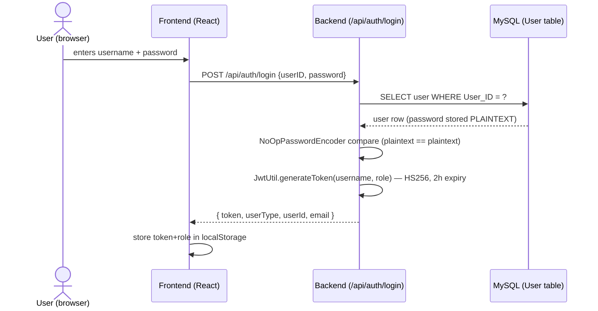
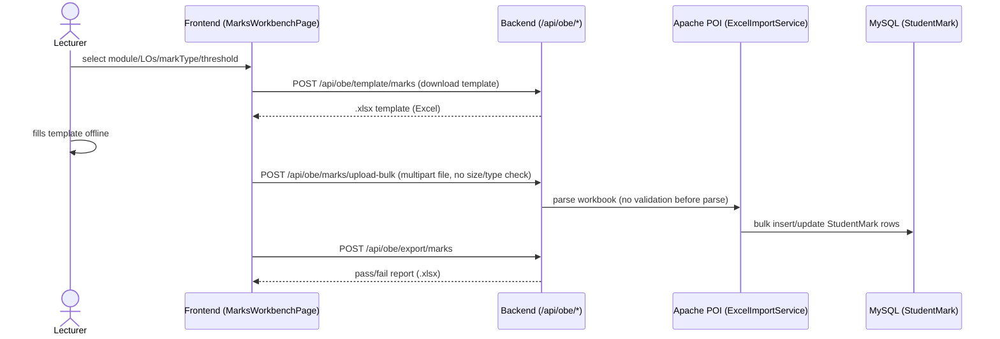
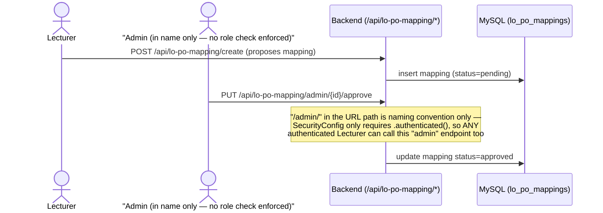
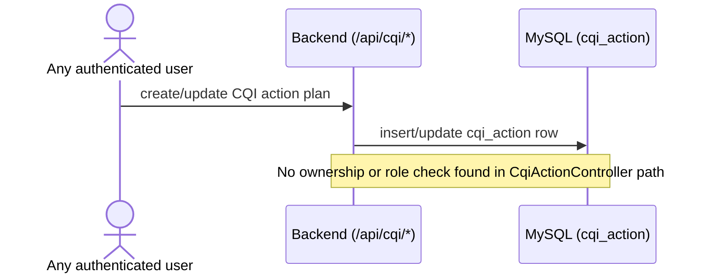

# 07 — Threat Model (Phase 3)

Built on the asset inventory (`02-asset-inventory.md`) and architecture review (`06-architecture-review.md`). Covers data flows, entry points, attack surfaces, STRIDE analysis, and a prioritized risk register.

> **Correction (Phase 5):** this document's original authorization analysis overstated the RBAC gap — it assumed "no `@PreAuthorize` found" meant "no role checks exist," but most controllers already implement equivalent checks manually (per-controller `isAdmin(token)`/`isLecturer(token)` helpers). The `/admin/...`-named LO/PO mapping endpoints, in particular, **do** already enforce admin-only access — the DFD #3 note below claiming otherwise is wrong. Also, **`/api/cqi` does not exist as a live endpoint** (no controller implemented, only a data model) — DFD #4 and all `/api/cqi` references below describe a feature that isn't built yet, not a real attack surface. See `06-architecture-review.md`'s Authorization architecture section for the corrected picture, and the risk register's per-row status notes for what Phase 5 actually found and fixed. Left otherwise unedited as a historical record of the Phase 3 analysis.

## Data Flow Diagrams

### 1. Login flow

### 2. Marks bulk upload / export flow

### 3. LO/PO mapping approval flow

### 4. CQI (Continuous Quality Improvement) workflow

## Entry points

| Entry point | Method(s) | Auth required | Role enforced server-side? |
|---|---|---|---|
| `/api/auth/login` | POST | No (public) | N/A |
| `/api/auth/add-admin` | POST | Yes (manual token decode in controller) | Yes — only this one endpoint checks `isSuperAdmin(token)` |
| `/api/auth/add-lecture` | POST | Yes (manual token decode) | Yes — checks `isAdmin(token)` |
| `/api/auth/add-user` | POST | Yes (manual token decode) | Partial — same manual checks |
| `/api/auth/debug/user/{username}` | GET | **No — permitAll** | **No** — anyone can enumerate any user's email/role |
| `/api/auth/create-test-user` | POST | **No — permitAll** | N/A (intentionally public test helper — must not exist outside dev/test) |
| `/api/modules/**` (create/all/{id}/update/delete) | GET/POST/PUT/DELETE | Yes (`.authenticated()` only) | **No** |
| `/api/obe/**` (20+ routes: PO CRUD, mappings, marks upload/export, attainment, reports, "admin/approve-mapping") | GET/POST/PUT/DELETE | Yes (`.authenticated()` only) | **No**, including the path literally named `admin/approve-mapping/{id}` |
| `/api/obe/assessment/**` | GET/POST | Yes (`.authenticated()` only) | **No** |
| `/api/cqi/**` | (CRUD) | Yes (`.authenticated()` only) | **No** |
| `/api/los-with-mapping/**` | GET/POST/PUT | Yes (`.authenticated()` only) | **No** |
| `/api/lo-po-mapping/**` (incl. `admin/pending`, `admin/{id}/approve`, `admin/{id}/reject`, `admin/lo/{id}/approve-all`, `admin/report/{id}`) | GET/POST/PUT/DELETE | Yes (`.authenticated()` only) | **No** — "admin" paths are naming convention only |
| `/api/program-outcomes/**` (incl. `initialize-defaults`, permanent delete, restore, reorder) | GET/POST/PUT/DELETE | Yes (`.authenticated()` only) | **No** |
| `/api/lospos/**` (marks CRUD, batch delete, Excel export/import) | GET/POST/PUT/DELETE | Yes (`.authenticated()` only) | **No** |
| File upload endpoints (`/api/obe/marks/upload-bulk`, `/upload-question-wise`, `/marks/upload/{losId}`, `/lospos/{loId}/marks/import-obe`) | POST (multipart) | Yes (`.authenticated()` only) | No type/size validation found |

## Attack surfaces

1. **JWT validation surface** — signature/expiry check only; no revocation, no `ROLE_`-prefix, single shared HS256 secret currently hardcoded in source.
2. **Authorization surface (the big one)** — every live endpoint outside `UserRestController` accepts any authenticated user regardless of role. A Lecturer JWT is sufficient to hit every "admin" path, delete Program Outcomes, approve their own LO/PO mappings, or modify another lecturer's module/marks.
3. **Unauthenticated information disclosure** — `/api/auth/debug/user/{username}` and `/api/auth/create-test-user` are public by design of the blanket `/api/auth/**` permitAll rule, not because they individually need to be.
4. **File upload / parsing surface** — 4+ Excel upload endpoints via Apache POI with no content-type, extension, or size limits before parsing.
5. **Client-side trust surface** — `ProtectedRoute` role gating and `localStorage` JWT storage are both attacker-visible/modifiable from the browser; every real control must live server-side (currently mostly doesn't).
6. **Credential storage surface** — plaintext passwords in the `User` table; a DB read (via any future SQL injection, backup leak, or insider access) yields usable credentials directly.
7. **CI/CD surface** — CodeQL covers JavaScript only; the Java backend (where the actual authz gap lives) has no automated static analysis catching these patterns today.

## STRIDE analysis

| Entry point / surface | S | T | R | I | D | E |
|---|---|---|---|---|---|---|
| Login (`/api/auth/login`) | Credential stuffing possible (no rate limit) | — | No login audit log | Error messages are generic (good) | No brute-force throttling → resource exhaustion risk | — |
| JWT validation (all endpoints) | Stolen token = full impersonation for 2h, no revocation | Signature prevents tampering (good) | No per-request audit log of who did what | — | — | — |
| Any `/api/obe/**`, `/api/lo-po-mapping/**`, `/api/program-outcomes/**`, `/api/cqi/**`, `/api/modules/**` write endpoint | — | Any authenticated user can modify data outside their role/module (no ownership check) | No change log for marks/mapping/PO edits | — | — | **Elevation of Privilege — Lecturer acting as Admin is the single largest risk in this system** |
| `/api/auth/debug/user/{username}` | — | — | — | Unauthenticated user enumeration (email + role per username) | — | — |
| `/api/auth/create-test-user` | — | — | — | — | Repeated calls could be used to spam admin accounts (low impact, fixed credentials) | Unauthenticated user creation capability if ever left reachable outside a test environment |
| Excel upload endpoints | — | Malformed/oversized file could corrupt processing state | No record of who uploaded what file/when beyond DB row changes | Parsed content trusted without validation | Oversized/malformed file could exhaust backend memory/CPU | — |
| `User` table / credential storage | — | — | — | Plaintext passwords readable by anyone with DB access | — | — |
| Client-side role gating (`ProtectedRoute`, `localStorage`) | Trivial to spoof `userType` in localStorage to view UI for other roles (backend still gates actual data — or doesn't, per above) | Client state is fully attacker-controlled | — | — | — | Reinforces the server-side EoP risk above — UI hiding is not a control |

## Prioritized risk register

| # | Risk | STRIDE category | Likelihood | Impact | Priority | Traces to | Phase 5 status |
|---|---|---|---|---|---|---|---|
| 1 | Any authenticated user (any role) can perform admin-level actions on modules, marks, PO/LO mappings — no server-side RBAC | Elevation of Privilege | ~~High~~ Overstated — see correction note above | Critical (data integrity + accreditation validity) | **Critical** | REQ-AC-01, REQ-AC-02 (`04-security-requirements.md`) | **Revised & partially fixed.** Most write endpoints already had manual role checks (not a real bypass). Genuine gaps found and fixed: PO catalog GETs tightened to admin/superadmin, PO hard-delete tightened to superadmin-only. Remaining: object-level (cross-module) checks, deferred per Phase 4. |
| 2 | Passwords stored and compared in plaintext | Information Disclosure | Medium (requires DB access) | Critical (full credential compromise on any leak) | **Critical** | REQ-CRYPTO-01 | **Fixed.** `BCryptPasswordEncoder` now in use; `UserService.addUser`/`createTestUser` encode on write; test accounts re-seeded with real hashes. |
| 3 | Unauthenticated user enumeration via `/api/auth/debug/user/{username}` | Information Disclosure | High (no auth needed, trivially scriptable) | Medium (email/role leak, aids further attacks) | **High** | REQ-AC-03 | **Fixed.** Now requires `admin`/`superadmin` via `@PreAuthorize`. |
| 4 | JWT secret and DB password hardcoded in source (and likely in git history) | Information Disclosure / Spoofing | High (anyone with repo access) | Critical (forge tokens / direct DB access) | **Critical** | REQ-CRYPTO-02 | Not yet fixed — pending. |
| 5 | No rate limiting/lockout on login | Denial of Service / Spoofing | Medium | High (enables credential stuffing) | **High** | REQ-AUTH-02 | Not yet fixed — pending. |
| 6 | Excel upload endpoints accept unvalidated files | Tampering / Denial of Service | Medium | Medium-High | **High** | REQ-FILE-01 | Not yet fixed — pending. |
| 7 | No audit log for privileged actions (mapping approval, marks edits, login) | Repudiation | High (guaranteed gap, not probabilistic) | Medium (forensics/accreditation trust gap) | **High** | REQ-LOG-01 | Not yet fixed — pending. |
| 8 | No JWT revocation; stolen token valid full 2h regardless of logout | Spoofing | Low-Medium | Medium | **Medium** | (new — add to requirements in Phase 4) | Accepted residual risk per Phase 4 decision — not implemented. |
| 9 | `create-test-user` / `debug/user` endpoints reachable in any environment, not gated to dev/test profile | Elevation of Privilege / Info Disclosure | Medium (depends on deployment) | Medium | **Medium** | REQ-AC-03 | **Fixed.** `create-test-user` gated to `dev` Spring profile; `debug/user` requires admin/superadmin auth. |
| 10 | `ddl-auto=update` with no migration history | Tampering (accidental) | Low | Medium (schema drift risk, not attacker-driven) | **Low-Medium** | (Phase 1 finding) | Accepted residual risk per Phase 4 decision — not implemented. |
| 11 | CodeQL doesn't cover the Java backend | (enables all of the above to go undetected) | High (currently true) | Medium (detection gap, not a direct vuln) | **Medium** | (Phase 2 finding) | Not yet fixed — pending (CI/CD change, outside app code). |
| — | `/api/cqi` referenced as a live unprotected endpoint | — | — | — | **Removed** | — | **Correction:** controller doesn't exist; not a real attack surface. See note above. |

**Priority order for Phase 5 remediation**: #1, #2, #4 (Critical) → #3, #5, #6, #7 (High) → #8, #9 (Medium) → #10, #11 (Low-Medium, opportunistic). Progress so far: #2, #3, #9 fixed; #1 revised and partially fixed; #4, #5, #6, #7, #11 still pending.
